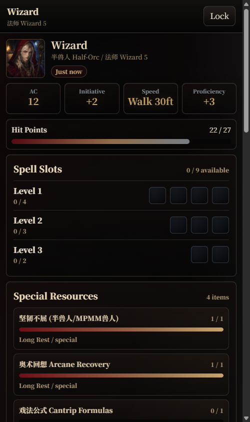
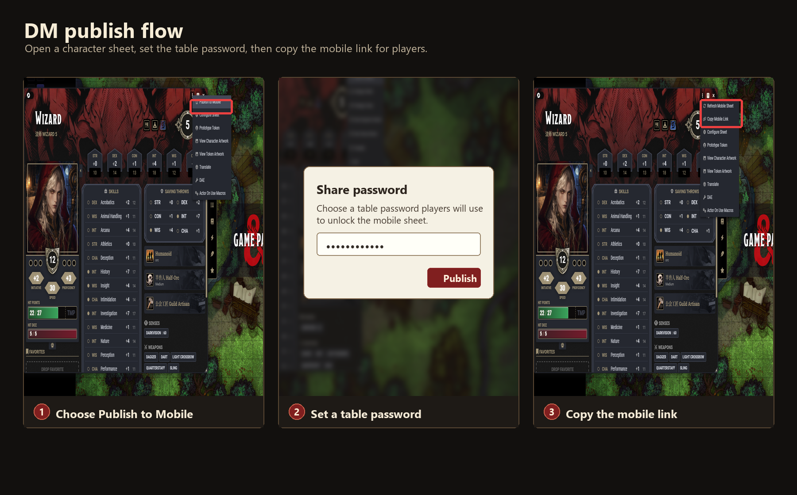
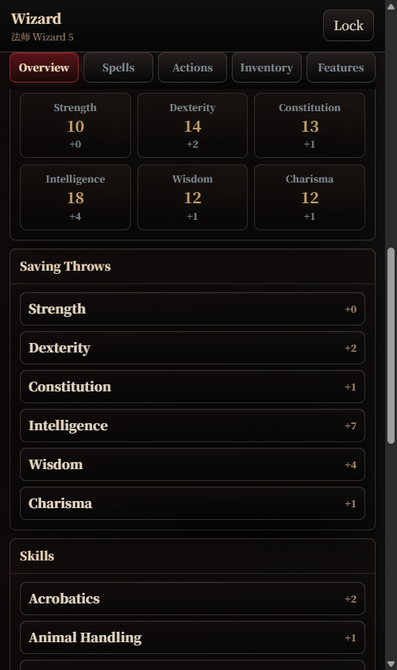
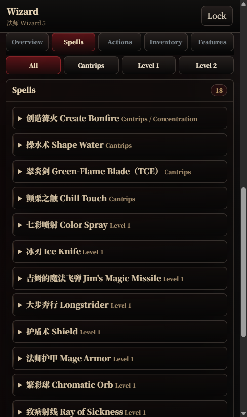
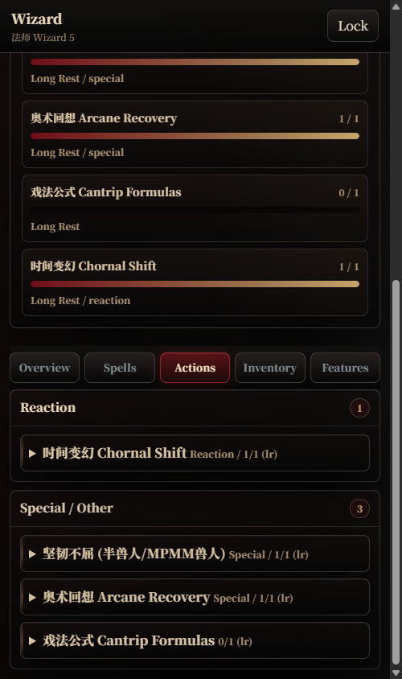
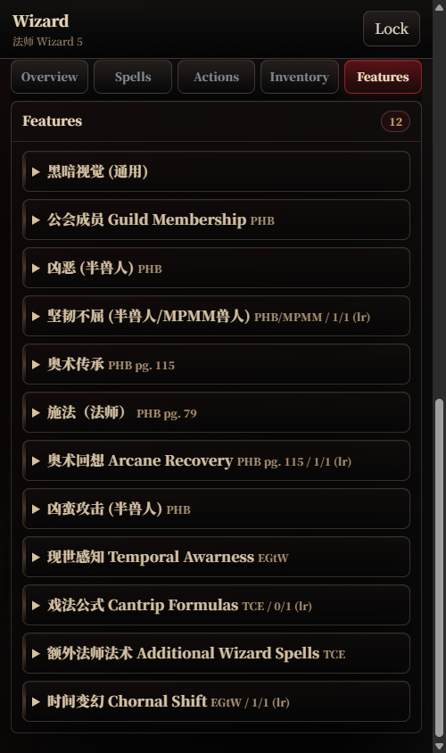

# SheetShare Mobile

手机优先、带密码保护的 Foundry VTT 角色卡分享模块。

SheetShare Mobile 让 GM 可以从 Foundry 里的 actor 发布一张适合手机阅读的角色卡。玩家打开分享链接，输入整桌分享密码，就能在手机上查看角色卡，不需要登录 Foundry。



## 功能

- 手机优先的 D&D 5e 角色卡阅读界面
- GM 按角色单独控制发布
- 带密码保护的静态快照
- 不公开角色列表
- 已打开角色卡在玩家设备上记住密码
- 已发布角色响应 `updateActor` 变化后自动刷新
- 英文和简体中文 UI
- Foundry 设置页里的管理面板和 Doctor 检查面板

角色名、物品名、法术名和描述来自你的 Foundry 世界数据。如果你的世界使用了翻译模块，发布出来的内容会跟随那个配置。

## 要求

- Foundry VTT v13
- D&D 5e system 5.3+
- 支持 WebCrypto 的现代浏览器
- 公开分享时使用 HTTPS

本地 HTTP 可以用于测试，但对外分享建议使用 HTTPS。

## 安装

### 使用 release zip

1. 下载最新的 `sheetshare-mobile.zip`。
2. 解压到 Foundry 数据目录：

   ```text
   Data/modules/sheetshare-mobile
   ```

3. 重启 Foundry 或刷新 setup 页面。
4. 在世界里启用 **SheetShare Mobile**。

### 从源码安装

把本仓库 clone 到 Foundry modules 目录：

```powershell
cd D:\FVTT_DATA\Data\modules
git clone https://github.com/tanis90/sheetshare-mobile.git sheetshare-mobile
```

然后在世界的模块列表里启用 **SheetShare Mobile**。

## 使用

1. 以 GM 身份登录。
2. 打开一个 character actor 的角色卡。
3. 在角色卡标题栏点击 **发布到手机**。
4. 输入整桌分享密码。
5. 点击 **复制手机链接**，把链接和密码发给玩家。

已发布角色可以在角色卡标题栏刷新，也可以在管理面板里刷新、复制链接或取消发布。

玩家成功解锁一次后，同一浏览器会记住这张角色卡。刷新或重新打开链接会自动解锁，直到 GM 用不同密码重新发布。公共设备上请点击 **锁定** 清除已保存密码。



玩家在手机上打开链接，输入同一个分享密码后，会看到手机优先的只读角色卡。

## 玩家角色卡预览

分享出去的角色卡本身就是主要体验：玩家在手机上可以快速查看属性、法术位、资源次数、法术列表、动作和特性索引。

| 属性与技能 | 法术 |
| --- | --- |
|  |  |

| 动作 | 特性 |
| --- | --- |
|  |  |

## 设置

打开 **游戏设置 > 配置设置 > SheetShare Mobile**。

可用设置：

- **Actor 更新时自动刷新**：开启后，只要 GM 浏览器当前会话里有分享密码，已发布角色在 `updateActor` 变化后会自动刷新手机角色卡。
- **HTTP 分享警告**：当前 Foundry 页面不是 HTTPS 时，Doctor 会提示公开分享风险。
- **分享页语言**：可选择跟随玩家浏览器、跟随 Foundry 世界语言、强制英文或强制简体中文。

设置页里还有两个入口：

- **已发布角色卡**：管理已发布角色，复制链接、刷新或取消发布。
- **Doctor 检查**：检查存储、分享页资源、访问协议和常见配置问题。

## 安全

每张已发布角色卡都会保存为加密静态快照。密码不会放在 URL 里，也不会由分享页发送给服务器。直接打开 JSON 快照不会看到明文角色卡内容。

为了方便玩家使用，分享页成功解锁后会把密码保存在玩家自己的浏览器本地。点击 **锁定** 会清除这份本地密码；如果 GM 用新密码重新发布，旧密码会自动失效。

公开分享时请使用 HTTPS，避免链接和密码输入页在传输过程中被截获。

## 语言

SheetShare Mobile 的 Foundry 模块界面和手机分享页都有英文、简体中文两套 UI。

分享页语言按下面顺序决定：

1. 分享 URL 中的 `lang`
2. GM 设置的分享页语言
3. 玩家浏览器语言

角色内容本身由 GM 的 Foundry 世界数据和安装的翻译模块决定。

## 排查

- 先从模块设置页运行 **Doctor 检查**。
- 如果存储失败，确认 Foundry 可以写入并通过网页访问 `Data/assets/sheetshare-mobile`。
- 如果公开分享出现 HTTP 警告，把 Foundry 放到 HTTPS 反向代理后面。
- 如果更新模块后链接仍显示旧界面，刷新浏览器并重启 Foundry。
- 如果以前启用了 `cn5e-sheet-export`，建议禁用它，避免角色卡标题栏出现重复入口。

## 维护者

发布流程见 [docs/RELEASE-zh.md](docs/RELEASE-zh.md)。

## 当前范围

第一版公共发布目标聚焦常见单 GM 工作流。当前支持 `updateActor` 自动刷新。物品、法术准备、Active Effect 变动的专用 hook 会在更完整的系统实测后作为后续工作补上。
