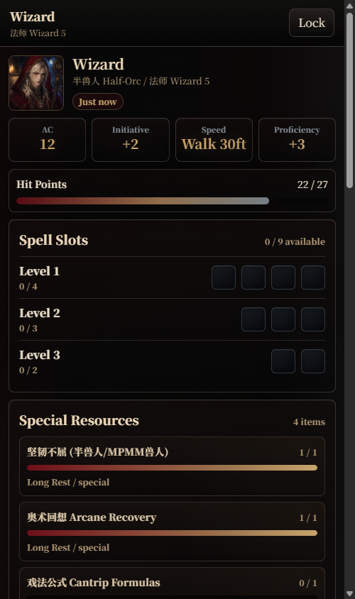
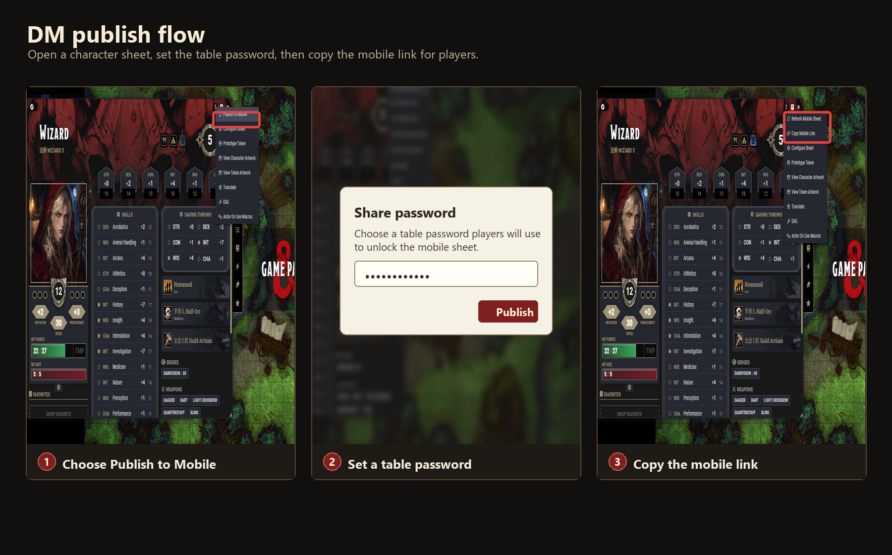
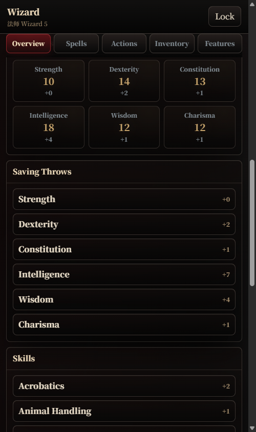
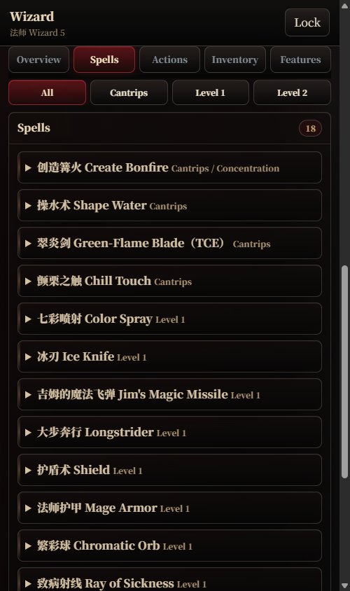
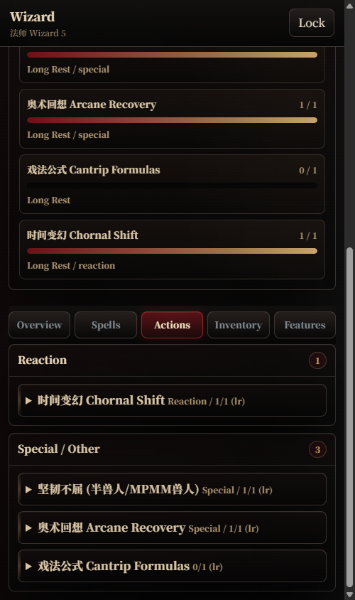
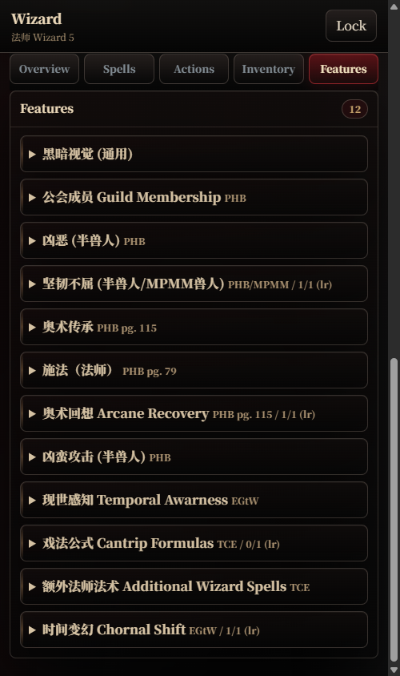

> **⚠️ 本仓库已迁移。** SheetShare Mobile 现在在
> [arcanedesk-fvtt-mods monorepo](https://github.com/tanis90/arcanedesk-fvtt-mods/tree/main/modules/sheetshare-mobile)
> 内开发与发布，本独立仓库已冻结并将归档。安装当前版本请使用 monorepo manifest：
> `https://raw.githubusercontent.com/tanis90/arcanedesk-fvtt-mods/main/modules/sheetshare-mobile/module.json`
> （或从 [arcanedesk-fvtt-mods releases](https://github.com/tanis90/arcanedesk-fvtt-mods/releases) 下载）。
> 跟踪本仓库 manifest 的既有安装不会自动收到更新，请按新 manifest 重装。

# SheetShare Mobile

手机优先的 Foundry VTT 角色卡分享模块。默认使用带密码保护的加密快照；如果你有自己的门户或反向代理认证，也可以启用 External Auth 模式。

SheetShare Mobile 让 GM 可以从 Foundry 里的 actor 发布一张适合手机阅读的角色卡。玩家打开分享链接，输入整桌分享密码，就能在手机上查看角色卡，不需要登录 Foundry。



## 功能

- 手机优先的 D&D 5e 角色卡阅读界面
- GM 按角色单独控制发布
- 默认使用带密码保护的加密静态快照
- 可选 External Auth 模式，适合已有门户或反向代理认证的部署
- 不公开角色列表
- 已打开角色卡在玩家设备上记住密码
- 已发布角色响应角色、物品或 Active Effect 变化后自动刷新
- 英文和简体中文 UI
- Foundry 设置页里的管理面板和 Doctor 检查面板

角色名、物品名、法术名和描述来自你的 Foundry 世界数据。如果你的世界使用了翻译模块，发布出来的内容会跟随那个配置。

## 要求

- Foundry VTT v13
- D&D 5e system 5.3+
- 支持 WebCrypto 的现代浏览器（密码模式必需；External Auth 模式在纯 HTTP 下也可用）
- 公开分享时使用 HTTPS

本地 HTTP 可以用于测试，但对外分享建议使用 HTTPS。

## 安装

### 使用 release zip

1. 下载最新的 `sheetshare-mobile.zip`。
2. 解压到 Foundry 数据目录：

   ```text
   Data/modules/sheetshare-mobile
   ```

3. 重启 Foundry 或刷新 setup 页面。
4. 在世界里启用 **SheetShare Mobile**。

### 从源码安装

把本仓库 clone 到 Foundry modules 目录：

```powershell
cd D:\FVTT_DATA\Data\modules
git clone https://github.com/tanis90/sheetshare-mobile.git sheetshare-mobile
```

然后在世界的模块列表里启用 **SheetShare Mobile**。

## 使用

1. 以 GM 身份登录。
2. 打开一个 character actor 的角色卡。
3. 在角色卡标题栏点击 **发布到手机**。
4. 输入整桌分享密码。
5. 点击 **复制手机链接**，把链接和密码发给玩家。

已发布角色可以在角色卡标题栏刷新，也可以在管理面板里刷新、复制链接或取消发布。

角色首次发布时会得到 `<世界>-<角色名>` 形式的稳定可读 key。中文会原样保留，例如 `dragonlance-黎安娜-晨盾`；显式 key 不会被自动改写，只有可读 key 已被占用时才会追加短 actor-id。纯中文角色若还保留旧版通用 key `character`，会在下次刷新时自动迁移。

玩家成功解锁一次后，同一浏览器会记住这张角色卡。刷新或重新打开链接会自动解锁，直到 GM 用不同密码重新发布。公共设备上请点击 **锁定** 清除已保存密码。



玩家在手机上打开链接，输入同一个分享密码后，会看到手机优先的只读角色卡。

如果你的网站已经用门户或反向代理保护了分享页和快照资源，可以把 **访问模式** 切到 **External Auth / 受信门户**。这个模式下 GM 发布的是 trusted 快照，玩家不需要再输入 SheetShare 密码。

External Auth 世界会在主 GM 进入 `ready` 后自动刷新已发布角色。发布身份校验、克隆/导入规则以及按世界隔离的头像镜像详见 [发布生命周期与门户媒体](docs/PUBLISHING-LIFECYCLE.md)。

## 玩家角色卡预览

分享出去的角色卡本身就是主要体验：玩家在手机上可以快速查看属性、法术位、资源次数、法术列表、动作和特性索引。

| 属性与技能 | 法术 |
| --- | --- |
|  |  |

| 动作 | 特性 |
| --- | --- |
|  |  |

## 设置

打开 **游戏设置 > 配置设置 > SheetShare Mobile**。

可用设置：

- **自动刷新已发布角色卡**：开启后，只要 GM 浏览器当前会话里有分享密码，已发布角色在角色、物品或 Active Effect 变化后会自动刷新手机角色卡。
- **HTTP 分享警告**：当前 Foundry 页面不是 HTTPS 时，Doctor 会提示公开分享风险。
- **分享页语言**：可选择跟随玩家浏览器、跟随 Foundry 世界语言、强制英文或强制简体中文。
- **访问模式**：使用带密码保护的加密快照，或在 `/modules/sheetshare-mobile/viewer` 和 `/assets/sheetshare-mobile` 已经由门户或反向代理保护时使用 External Auth。

设置页里还有两个入口：

- **已发布角色卡**：管理已发布角色，复制链接、刷新或取消发布。
- **Doctor 检查**：检查存储、分享页资源、访问协议和常见配置问题。

## 安全

### 访问模式与暴露面

两种访问模式保护的东西不同，任何一种都不能单独让已发布文件保密：

| | 密码模式（默认） | External Auth 模式 |
| --- | --- | --- |
| 磁盘上的快照 | AES-GCM 加密（PBKDF2 + WebCrypto） | 明文 trusted 快照 |
| 访问控制由谁保证 | 分享密码，在分享页输入 | **你的部署**——Foundry 前面的反向代理或门户 |
| 需要安全上下文（HTTPS/localhost） | 需要，GM 端和玩家端都需要 | 不需要——纯 HTTP 下也能发布 |

分享链接前，每位 GM 都应该知道：

1. **`_latest.json` 是公开索引。** 任何能访问你世界地址的人都可以请求 `assets/sheetshare-mobile/<world>/_latest.json`，读出所有已发布角色的 `name` 和 `slug`。随机 slug 只是稳定标识符，**不是访问控制**：拿到 slug 就能拼出 viewer 链接。模块自己的分享页不使用这个索引（分享链接直接指向 `<slug>.json`）；它只为外部工具存在，应视为公开数据。
2. **External Auth 快照是明文。** 没有外层认证时，`_latest.json` 加上快照直链意味着"任何知道服务器地址的人都能枚举并读取所有已发布角色卡"。请只在反向代理或门户之后使用该模式。
3. **取消发布即撤销链接。** 从 v0.5.0 起，取消发布会用撤销标记文档替换快照文件，已分享的直链立即失效（分享页会显示"已取消发布"提示）。`media/` 下的头像文件按内容寻址、保留在磁盘上；Foundry 13 没有删除数据文件的客户端 API，需要时可手动清理（见下）。
4. **删除已发布角色不会撤销其链接。** 删除角色会移除其 flags，但快照文件仍在被提供。请先取消发布，再删除角色。
5. **密码模式需要 WebCrypto**，浏览器只在安全上下文中提供它。在局域网 IP 的纯 HTTP 下，密码模式发布会明确报"需要 HTTPS 或 localhost"。External Auth 模式不受影响：它的哈希（变更检测、头像命名）会自动降级为非加密摘要，绝不用于加密。

### 反向代理最小示例

External Auth 模式下，请把分享页和快照资源一起保护起来。以下前缀之外的路径（Foundry 本体）可以走你正常的认证：

```nginx
# 为手机分享页和快照资源启用认证
location ~ ^/(modules/sheetshare-mobile/(viewer/)?|assets/sheetshare-mobile/) {
    auth_basic "SheetShare Mobile";
    auth_basic_user_file /etc/nginx/foundry_sheetshare.htpasswd;
    proxy_pass http://127.0.0.1:30000;
    proxy_set_header Host $host;
}
```

玩家在分享页加载前先完成门户的用户名/密码认证。

### 清理头像媒体文件

头像文件存放在 `Data/assets/sheetshare-mobile/<world>/media/<digest>.<ext>`。要找出不再被任何已发布角色引用的文件，可以把目录列表与 `assets/sheetshare-mobile/<world>/_latest.json` 里的 `portrait` 值对比，在 Foundry 停止时删除多余的文件。仍在列表中的文件不要删——它们是已发布角色卡的当前头像。

### 如何解读 Doctor 检查项

- **访问协议 / HTTP 警告**：Foundry 页面通过纯 HTTP 提供。本地测试没问题；公开分享应使用 HTTPS（密码模式硬性要求，见上）。
- **访问模式 / External Auth 警告**：提醒 trusted 快照在没有自行认证保护 `/modules/sheetshare-mobile/viewer` 和 `/assets/sheetshare-mobile` 时是不设防的。出现这条警告不代表保护已存在——请自行验证，例如用无门户凭据的隐私浏览器窗口打开一条分享链接试试。

### 密码处理细节

每张已发布角色卡都会保存为加密静态快照。密码不会放在 URL 里，也不会由分享页发送给服务器。直接打开 JSON 快照不会看到明文角色卡内容。

为了方便玩家使用，分享页成功解锁后会把密码保存在玩家自己的浏览器本地。点击 **锁定** 会清除这份本地密码；如果 GM 用新密码重新发布，旧密码会自动失效。

公开分享时请使用 HTTPS，避免链接和密码输入页在传输过程中被截获。

External Auth 模式会写出可直接读取的 trusted 快照。只有在外层认证同时保护分享页和 `Data/assets/sheetshare-mobile` 时才应启用；否则能拿到 JSON 的人就能读取已发布角色卡。

## 语言

SheetShare Mobile 的 Foundry 模块界面和手机分享页都有英文、简体中文两套 UI。

分享页语言按下面顺序决定：

1. 分享 URL 中的 `lang`
2. GM 设置的分享页语言
3. 玩家浏览器语言

角色内容本身由 GM 的 Foundry 世界数据和安装的翻译模块决定。

## 排查

- 先从模块设置页运行 **Doctor 检查**。
- 如果存储失败，确认 Foundry 可以写入并通过网页访问 `Data/assets/sheetshare-mobile`。
- 如果公开分享出现 HTTP 警告，把 Foundry 放到 HTTPS 反向代理后面。
- 如果更新模块后链接仍显示旧界面，刷新浏览器并重启 Foundry。
- 如果以前启用了 `cn5e-sheet-export`，建议禁用它，避免角色卡标题栏出现重复入口。

## 维护者

发布流程见 [docs/RELEASE-zh.md](docs/RELEASE-zh.md)。

## 当前范围

第一版公共发布目标聚焦常见单 GM 工作流。当前支持已发布角色在角色、物品和 Active Effect 变化后自动刷新。

## 许可证

本项目基于 [MIT 许可证](LICENSE) 开源。内置的 `viewer/assets/alpine.min.js` 来自 [Alpine.js](https://alpinejs.dev/)，同样基于 MIT 许可证。
