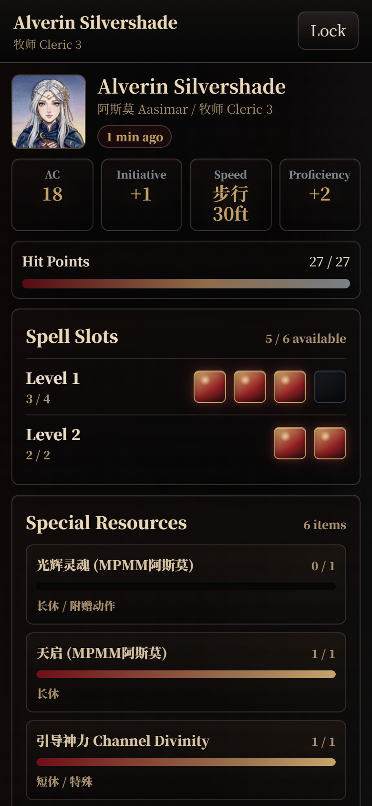
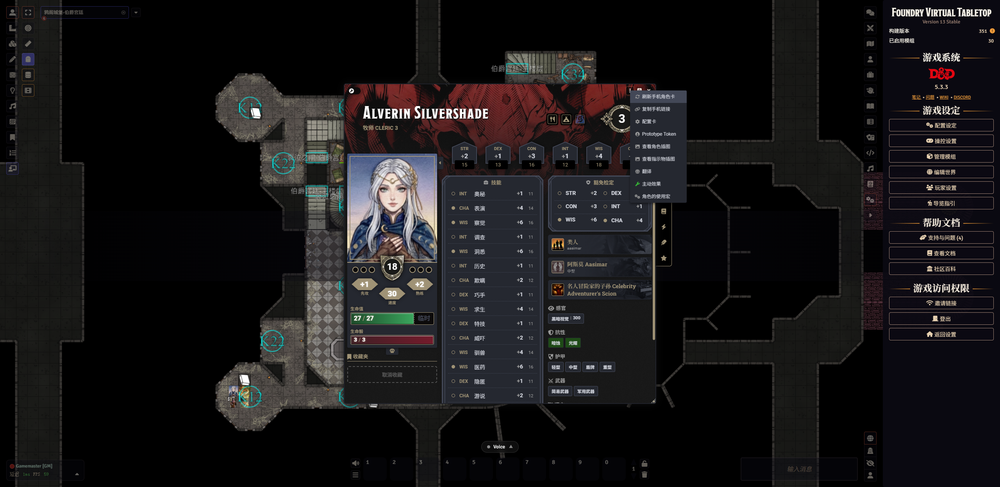
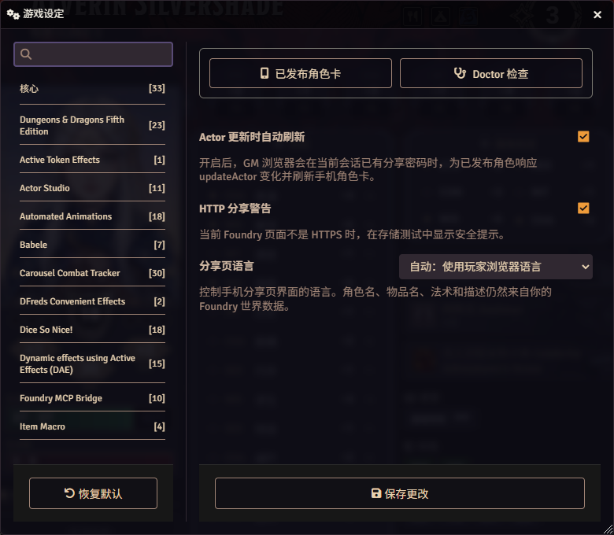

# SheetShare Mobile

Mobile-first, password-protected character sheet sharing for Foundry VTT.

SheetShare Mobile lets a GM publish a clean mobile character sheet from a Foundry actor. Players open a shared link, enter the table password, and read the sheet on a phone without logging in to Foundry.



## Features

- Mobile-first D&D 5e character sheet viewer
- GM-controlled publishing per character
- Password-protected static snapshots
- No public character index
- Device-local password memory for opened sheets
- Auto-refresh after published actors receive `updateActor` changes
- English and Simplified Chinese UI
- Manager and Doctor panels in Foundry settings

Character names, item names, spell names, and descriptions come from your Foundry world data. If your world uses a translation module, the published content follows that setup.

## Requirements

- Foundry VTT v13
- D&D 5e system 5.3+
- A modern browser with WebCrypto support
- HTTPS for public sharing

Local HTTP works for testing, but public links should be served over HTTPS.

## Installation

### From a release zip

1. Download the latest `sheetshare-mobile.zip`.
2. Extract it to your Foundry data folder:

   ```text
   Data/modules/sheetshare-mobile
   ```

3. Restart Foundry or reload the setup page.
4. Enable **SheetShare Mobile** in your world.

### From source

Clone this repository into your Foundry modules directory:

```powershell
cd D:\FVTT_DATA\Data\modules
git clone https://github.com/YOUR-NAME/sheetshare-mobile.git sheetshare-mobile
```

Then enable **SheetShare Mobile** in the world module list.

## Usage

1. Log in as GM.
2. Open a character actor sheet.
3. Click **Publish to Mobile** in the sheet header.
4. Enter the table share password.
5. Click **Copy Mobile Link** and send the link plus password to the player.

Published sheets can be refreshed from the actor sheet header or from the manager panel.

After a successful unlock, the player viewer remembers that sheet on the same browser. Refreshing or reopening the link unlocks automatically until the GM republishes with a different password. Use **Lock** on shared devices to clear the saved password.



## Settings

Open **Game Settings > Configure Settings > SheetShare Mobile**.



Available settings:

- **Auto-refresh on actor updates**: refreshes published sheets after `updateActor` changes while a GM browser has the share password in memory.
- **Warn when sharing over HTTP**: shows a Doctor warning when the current Foundry page is not using HTTPS.
- **Viewer language**: choose browser auto-detection, the Foundry world language, English, or Simplified Chinese.

The settings page also exposes:

- **Published Sheets**: manage published characters, copy links, refresh, or unpublish.
- **Doctor**: check storage, viewer assets, protocol, and common setup problems.


## Security

Each published character sheet is stored as an encrypted static snapshot. The password is not placed in the URL and is not sent to the server by the viewer. Directly opening the JSON snapshot does not reveal the character sheet.

For convenience, the viewer can remember the password locally on the player's device after a successful unlock. This local password is cleared by **Lock**, and it stops working if the GM republishes with a different password.

Use HTTPS for public sharing so the link and password entry page are protected in transit.

## Language

SheetShare Mobile has English and Simplified Chinese UI for both the Foundry module and the mobile viewer.

The viewer language is selected in this order:

1. `lang` in the share URL
2. the GM's viewer language setting
3. the player's browser language

The actor content language is controlled by the GM's Foundry world data and installed translation modules.

## Troubleshooting

- Run **Doctor** from the module settings page first.
- If storage fails, make sure Foundry can write and serve files under `Data/assets/sheetshare-mobile`.
- If public sharing shows an HTTP warning, put Foundry behind an HTTPS reverse proxy.
- If links still show an old UI after updating the module, reload the browser and restart Foundry.
- If you previously used `cn5e-sheet-export`, disable it to avoid duplicate sheet controls.

## Current Scope

The first public target focuses on the common single-GM workflow. `updateActor` auto-refresh is supported. Dedicated hooks for item, spell preparation, and active effect mutations are tracked as follow-up work after wider system testing.
